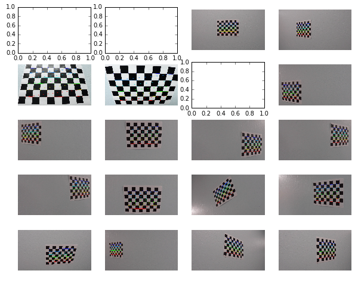
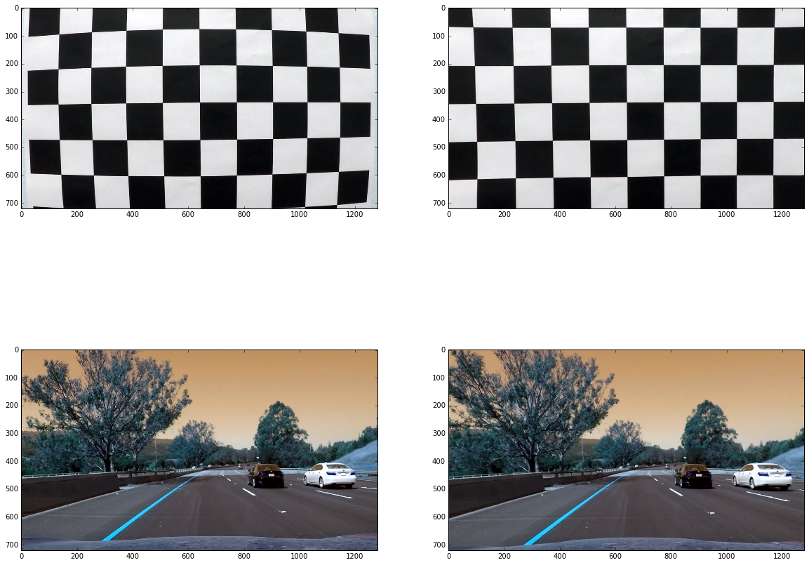
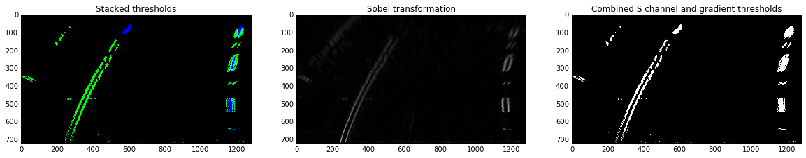
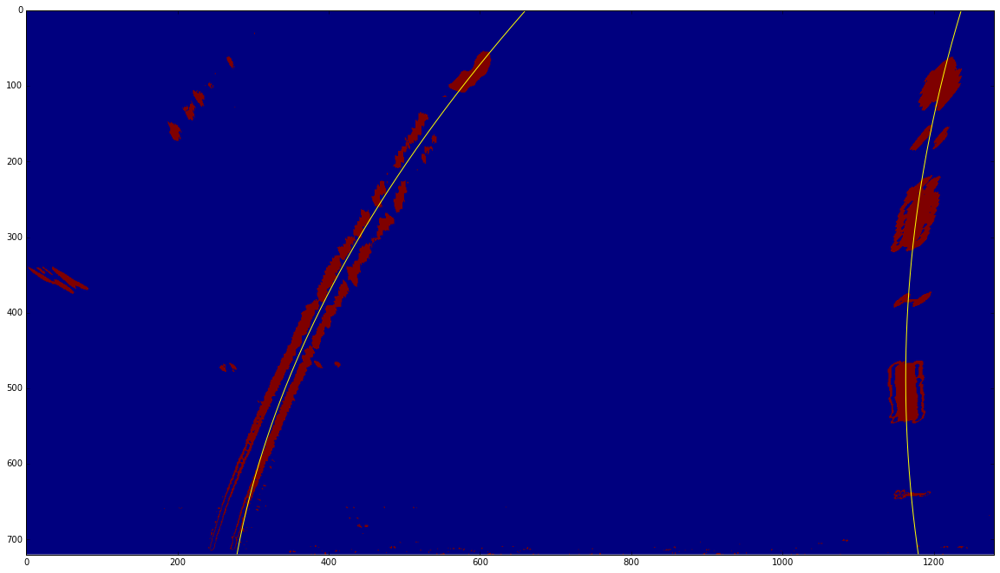
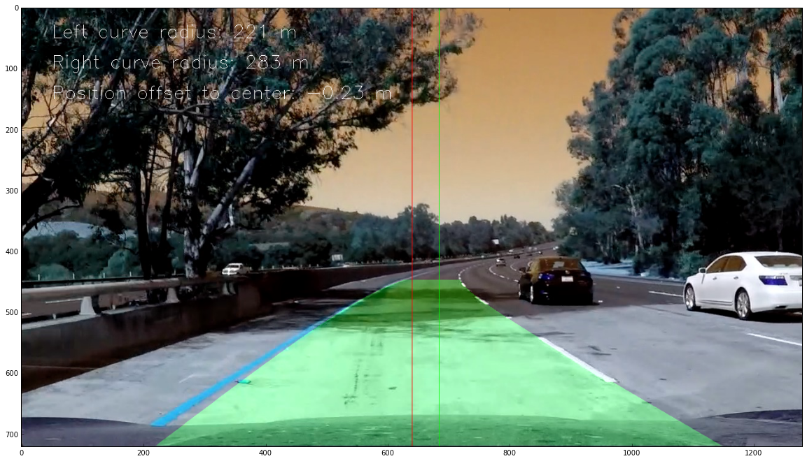

# Advanced Lane Finding Project

The goals / steps of this project are the following:

* Compute the camera calibration matrix and distortion coefficients given a set of chessboard images.
* Apply a distortion correction to raw images.
* Use color transforms, gradients, etc., to create a thresholded binary image.
* Apply a perspective transform to rectify binary image ("birds-eye view").
* Detect lane pixels and fit to find the lane boundary.
* Determine the curvature of the lane and vehicle position with respect to center.
* Warp the detected lane boundaries back onto the original image.
* Output visual display of the lane boundaries and numerical estimation of lane curvature and vehicle position.

## [Rubric](https://review.udacity.com/#!/rubrics/571/view) Points

Here I will consider the rubric points individually and describe how I addressed each point in my implementation.  


### Writeup / README

#### 1. Provide a Writeup / README that includes all the rubric points and how you addressed each one.  You can submit your writeup as markdown or pdf.  [Here](https://github.com/udacity/CarND-Advanced-Lane-Lines/blob/master/writeup_template.md) is a template writeup for this project you can use as a guide and a starting point.  

You're reading it!

### Camera Calibration

#### 1. Briefly state how you computed the camera matrix and distortion coefficients. Provide an example of a distortion corrected calibration image.

The code for this step is contained in the first code cell of the IPython notebook located in ./"Advanced Lane Finding.ipynb".  

I start by preparing "object points", which will be the (x, y, z) coordinates of the chessboard corners in the world. Here I am assuming the chessboard is fixed on the (x, y) plane at z=0, such that the object points are the same for each calibration image.  Thus, `objp` is just a replicated array of coordinates, and `objpoints` will be appended with a copy of it every time I successfully detect all chessboard corners in a test image.  `imgpoints` will be appended with the (x, y) pixel position of each of the corners in the image plane with each successful chessboard detection.  

I then used the output `objpoints` and `imgpoints` to compute the camera calibration and distortion coefficients using the `cv2.calibrateCamera()` function.  I applied this distortion correction to the test image using the `cv2.undistort()` function and obtained this result: 



### Pipeline (single images)

#### 1. Provide an example of a distortion-corrected image.

At the second cell of the notebook I'm undistorting an actual image retrieved from the vehicle camera.
To do so I get calibration parameters based on `objpoints` and `imgpoints` from the previous step:
```
ret, mtx, dist, rvecs, tvecs = cv2.calibrateCamera(objpoints, imgpoints, img_size, None, None)
```

Out of the number of values returned by the latter function we care only about `mtx` and `dist`, which are [camera matrix and distortion coefficients](https://docs.opencv.org/2.4.1/modules/calib3d/doc/camera_calibration_and_3d_reconstruction.html#calibratecamera) respectively.

We're them using for an utilitary purpose of applying the calibration parameters to camera images henceforth as below:
```
real_img = cv2.imread('./test_images/test6.jpg')
real_dst = cv2.undistort(real_img, mtx, dist, None, mtx)
```



#### 2. Describe how (and identify where in your code) you performed a perspective transform and provide an example of a transformed image.

I perform perspective warp across the notebook cell titled as Transform perspective. For the sake of readability and flexibility I've expressed the coordinates in relative values rather than absolute.

```
def region_of_interest_coords(shape):
```
This function returns a numpy array of coordinates calculated by relative padding, ratio of trapezoid horisontal sides and relative height of it.

```
def dst_coords(shape):
```
Returns a numpy array of destination coordinates calculated according to the image size

```
def draw_lines(img, coords):
```
A generic function drawing lines by given coordinates on a given image. You might like the way I construct lines array by using zipping coords with themselves.

I use these functions to transform the perspective:

```
src = region_of_interest_coords(undistorted.shape)
dst = dst_coords(undistorted.shape)
M = cv2.getPerspectiveTransform(src, dst)
Minv = cv2.getPerspectiveTransform(dst, src)
warped = cv2.warpPerspective(
    undistorted, M, 
    (undistorted.shape[1], undistorted.shape[0])
)

undistorted_lines = draw_lines(undistorted, src)
```


#### 3. Describe how (and identify where in your code) you used color transforms, gradients or other methods to create a thresholded binary image.  Provide an example of a binary image result.

Color transformation is done in the notebook cell of the same name.
I'm using a combination of two techniques, which is Sobel transformation and HLS color transformation.
For both transformation I use pretty much the same approach which is:
 - Perform the transformation with an OpenCV function:
 ```python
    hls = cv2.cvtColor(img, cv2.COLOR_RGB2HLS)
    # Tried L channel, and it actually works better
    s_channel = hls[:,:,1]
 ```
 and
 ```python
    gray = cv2.cvtColor(img, cv2.COLOR_RGB2GRAY)
    sobelx = cv2.Sobel(gray, cv2.CV_64F, 1, 0)
 ```
 - Treshold
  ```python
    # Threshold x gradient
    thresh_min = 30
    thresh_max = 100
    sxbinary = np.zeros_like(scaled_sobel)
    sxbinary[(scaled_sobel >= thresh_min) & (scaled_sobel <= thresh_max)] = 1
 ```
 and
 
 ```python
    # Threshold color channel
    s_thresh_min = 190
    s_thresh_max = 255
    s_binary = np.zeros_like(s_channel)
    s_binary[(s_channel >= s_thresh_min) & (s_channel <= s_thresh_max)] = 1
 ```
 - Then get the pixels detected by either technique:
 ```python
    combined_binary[(s_binary == 1) | (sxbinary == 1)] = 1
    
 ```
 
 

#### 4. Describe how (and identify where in your code) you identified lane-line pixels and fit their positions with a polynomial?

I perform this section in the cell titled as Finding lanes. To do so I reuse an algorithm provided in the materials as is. The course of actions is the following:
 
 - Given a color-transformed representation of birds-eye view perspective
 - Get peaks of the bottom half of the image:
 ```python
    histogram = np.sum(binary_warped[binary_warped.shape[0]//2:,:], axis=0)
 ```
 - Use the peaks of the histogram as a base for sliding window search. The peaks are the brightest areas, supposedly the lanes
 ```python
    leftx_base = np.argmax(histogram[:midpoint])
    rightx_base = np.argmax(histogram[midpoint:]) + midpoint
 ```
 - Then stack pixels above treshold for 9 windows on each side.
 - Window center is deifed as a middle of pixels collected by a previous iteration
 - Once pixels are stacked window by window use a simplistic version of 'Linear regression' which is 2nd power polynomial fit. Do it in pixels and in meters:
  
  ```python
    left_fit = np.polyfit(lefty, leftx, 2)
    right_fit = np.polyfit(righty, rightx, 2)
    
    left_fit_m = np.polyfit(lefty * ym_per_pix, leftx * xm_per_pix, 2)
    right_fit_m = np.polyfit(righty * ym_per_pix, rightx * xm_per_pix, 2)

 ```




#### 5. Describe how (and identify where in your code) you calculated the radius of curvature of the lane and the position of the vehicle with respect to center.

This calculation is based on the given formula and captured under the function:
```python
    def curvature_radius(y_eval, left_fit, right_fit, xm_per_pix=3.7/700, ym_per_pix=30/720):
        # Calculate the new radii of curvature
            
        left_curverad = ((1 + (2*left_fit[0]*y_eval*ym_per_pix + left_fit[1])**2)**1.5) / np.absolute(2*left_fit[0])
        right_curverad = ((1 + (2*right_fit[0]*y_eval*ym_per_pix + right_fit[1])**2)**1.5) / np.absolute(2*right_fit[0])
```

I calculate lanes center position in meters by calculating lanes postition based on the polynomial fit extracted on the previous stage, then calculate the middle point between them:

```python
    def center_postion(y_eval, x_max, left_fit, right_fit, xm_per_pix=3.7/700, ym_per_pix=30/720):
    y_eval *= ym_per_pix
    x_max *= xm_per_pix

    left_line = left_fit[0]*y_eval**2 + left_fit[1]*y_eval + left_fit[2]
    right_line = right_fit[0]*y_eval**2 + right_fit[1]*y_eval + right_fit[2]
    
    center = left_line + (right_line - left_line) / 2
    delta = (x_max / 2) - center
    
    return center, delta
```

#### 6. Provide an example image of your result plotted back down onto the road such that the lane area is identified clearly.

The entire pipeline is put together in the cell of the same name. Below is an example of an annotated image:



Additionally to the transformations and computations described above I've implemented a buffering mechanism to accumulate a given number of measurements, and average them.
Class Buf is a circular buffer of a given elements. Class Bufs is a wrapper on top of a collection of these buffers. I use these two classes to accumulate and average 35 measurements in a row.

Also I filter the measurements by curvature sanity checks such as ratio of the two and minimal radius of 150.

---

### Pipeline (video)

#### 1. Provide a link to your final video output.  Your pipeline should perform reasonably well on the entire project video (wobbly lines are ok but no catastrophic failures that would cause the car to drive off the road!).

Here's a [link to my video result](./output_video.mp4)

---

### Discussion

#### 1. Briefly discuss any problems / issues you faced in your implementation of this project.  Where will your pipeline likely fail?  What could you do to make it more robust?

- I would do a better job on the color transformation, because my current implementation is falling short on working with optional challenges. In particular it 'misinterprets' asphalt colors as lanes. I will try to apply other color spaces and channels to tackle this problem.
- Also, still my region of interest is a fixed trapezoid. It is very likely that a sharp turn will be simply out of it. I'd play with a different shape/proportions of ROI.


